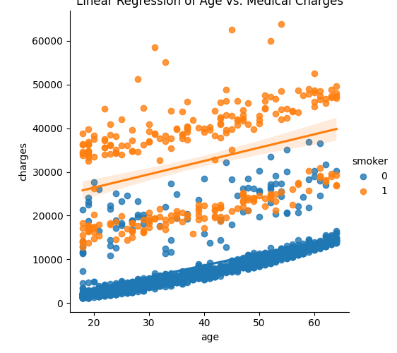

# 🏥 Project 01: Medical Insurance Cost Prediction

## 📌 Overview
This is my first machine learning project. The goal is to build a regression model that predicts the medical insurance costs for an individual based on their demographic and lifestyle data.

**Objective:** To master the fundamental workflow of Scikit-Learn:
`Define` → `Fit` → `Predict` → `Evaluate` → `Optimize`

## 📊 Data Distribution

**Detail:** The plot shows two clusters (smokers vs. non-smokers). Charges generally increase with age, and smokers tend to have higher costs at any given age.

## 🧠 The Model
* **Algorithm:** Decision Tree Regressor
* **Library:** Scikit-Learn
* **Features Used (Inputs):**
    * `age`: Age of the beneficiary
    * `bmi`: Body Mass Index
    * `children`: Number of children covered
    * `smoker`: Smoker status (Converted to numeric: 1=Yes, 0=No)
* **Target (Output):** * `charges`: Individual medical costs billed by health insurance

## ⚙️ How it Works
The model uses a **Decision Tree** to split data into branches to make decisions. 
* *Example:* It might learn that **Smokers** generally have higher costs than **Non-Smokers**, or that a higher **BMI** correlates with increased charges.
* The model is trained on a subset of the data and then tested on unseen data to verify its accuracy.

## 🚧 Challenges & Learnings
* **Data Preprocessing:** I learned to separate Features (`X`) from Targets (`y`).
    * **Feature Encoding:** Successfully converted categorical data (the 'smoker' column) into integers (`1` or `0`) using the Pandas `.map()` function, allowing the model to process the text data mathematically.
* **Overfitting & Validation:** Implemented `train_test_split()` to create a validation set.
    * Used `mean_absolute_error` (MAE) to measure how far off the model's predictions were from the actual prices.
* **Hyperparameter Tuning:** Learned to control the depth of the tree to prevent overfitting.
    * Wrote a loop to test different `max_leaf_nodes` values (5, 25, 50, etc.) to find the "sweet spot" for lowest error.

## 📂 File Structure
* `insurance_model.py`: The main Python script.
* `./datasets/insurance.csv`: The dataset source.
